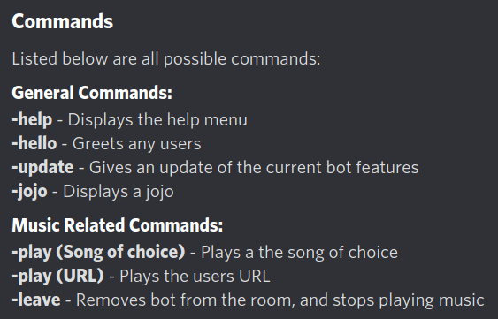
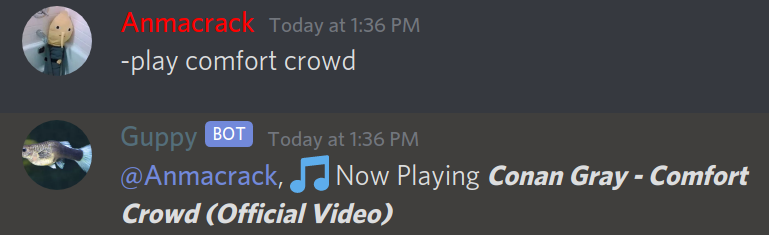
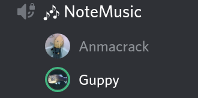

# Guppy
Guppy is an interactive discord bot that handles basic management of Discord servers. I use it to manage my own, but it's still in development; Hence, being online all the time is not something that happens frequently. If you'd like to grab a simple boilerplate to emulate some aspects of my bot, go [here](https://github.com/rampus-bit/DiscordBot-Sapling). Many more commands are pending, I just have to work on them a bit more. All files exist with the acception of my node folders. Go ahead and take anything you want from here, or the previous link; I will warn you though, some files include ID's specific to my server, so they might not work for you.

## Functionality
Small list of commands. Some other commands are available, but I haven't implemented them into '-help' yet.

### Music Player

<!---->
<!---->

<!---->
